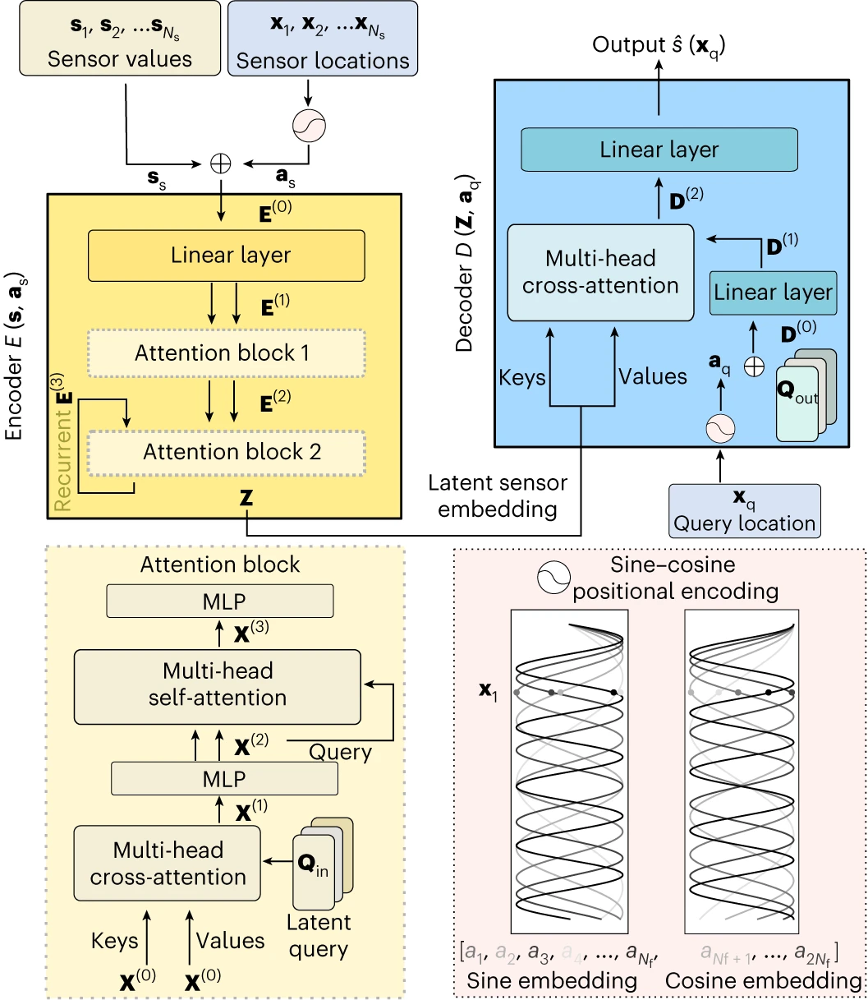
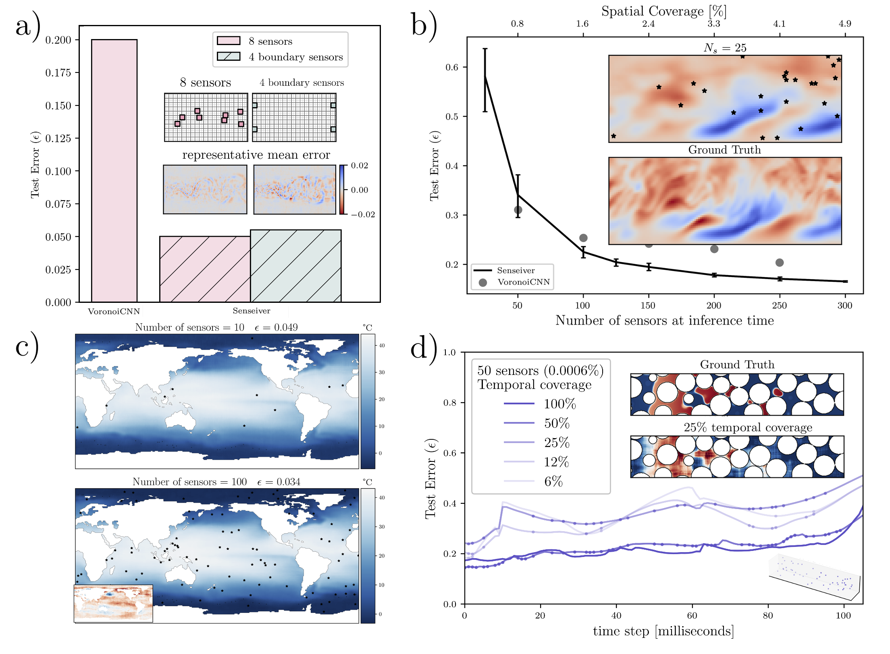

# The Senseiver


Implementation of *"The Senseiver: attention-based global field reconstruction from sparse observations"* in Pytorch. This model provides an easy and efficient way to train a data driven to create a mapping between sensor measurements an a global field, the model operations are decoupled from the size of the domain which allows the model to be trained with very large n-D arrays. The application shown in our paper considered simulations, but the method is general, and should be applicable to any other application.


## Architecture

<p align="center">
</img>
</p>

## Parameters

### Training parameters

- `data_name`: str.
Name of the dataset to be used for training.
- `num_sensors`: int.
number of sensors to train with
- `gpu_device`: int.
GPU to train on. MultiGPU support coming soon.
- `training_frames`: int.
Number of frames (time steps) to train the model with.
- `seed`: int.
If specified, it uses a seed to pick up sensors (if locations not specified) and frames.
- `consecutive_train`: bool.
Whether to use consecutive frames to train or chosen at random.
- `batch_frames`: int.
Number of frames per batch.
- `batch_pixels`: int.
Number of pixels per batch.
- `lr`: float.
Learning rate
- `accum_grads`: int.
Number of batches to accumulate to perform an optimizer step. 


### Model parameters

- `space_bands`: int.
Number of sine-cosine frequencies
- `enc_preproc_ch`: int.
Size of the linear layer that processes the inputs (sensor value+positons)
- `num_latents`: int.
Sequence size of the Q_in array.
- `enc_num_latent_channels`: int.
Channel dimension of the Q_in array.
- `num_layers`: int.
Number of model layers (depth).
- `num_cross_attention_heads`: int.
Number of processsing attention heads.
- `num_self_attention_layers_per_block`: int.
Number of self processing layers in each block.
- `dec_preproc_ch`: int.
Size of the linear layer that processes the latent space sent to the decoder. This can act as a bolttleneck and reduce significantly the number of parameters.
- `dec_num_latent_channels`: int.
Number of channels in the decoder.


### IO
- `load_model_num`: int.
Load a model to test or to re-train on. Our library saves the models sequencially starting with 1.
- `test`: bool.
To test the model in the entire dataset.


## Usage

```python
python train.py --gpu 0 --data cylinder --num_sensors 4 --training_frames 50 --cons False --seed 123 --enc_preproc 16 --dec_num_latent_channels 16 --enc_num_latent_channels 16 --num_latents 256 --dec_preproc_ch 16 --test False 
```


```bash
for num_frames in 100, 250, 500, 1000, 2000, 3000, 4000, 5000, 6000, 7000, 8000, 9000, 10000; do
    python train.py --gpu 1 --data pipe --num_sensors 6144 --cons False --seed 123 --enc_preproc 32 --dec_num_latent_channels 32 --enc_num_latent_channels 32 --num_latents 64 --dec_preproc_ch 32 --lr 1e-3 —training_frames $num_frames || break
done
```


## Results

<p align="center">
</img>
</p>

## Data availability
The data is available at [10.5281/zenodo.8290039](https://zenodo.org/record/8290040).
